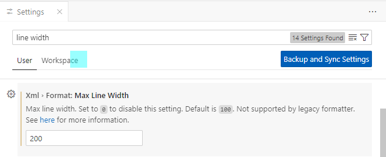
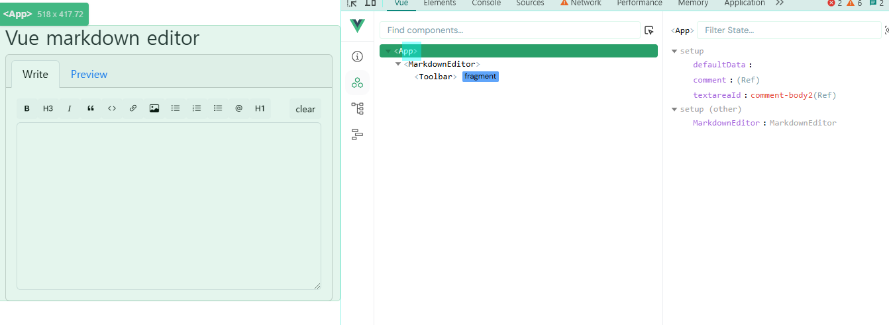
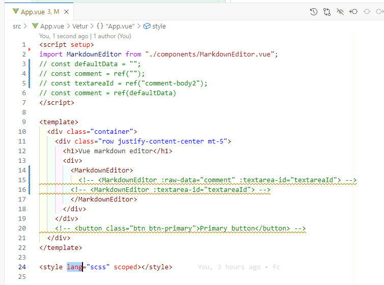
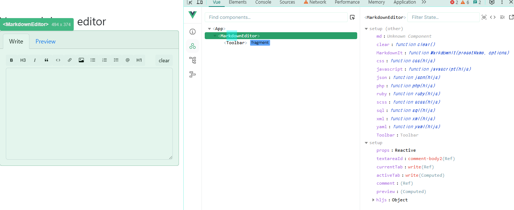
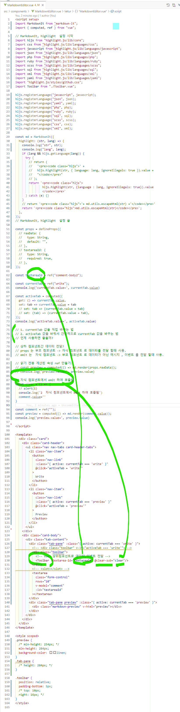
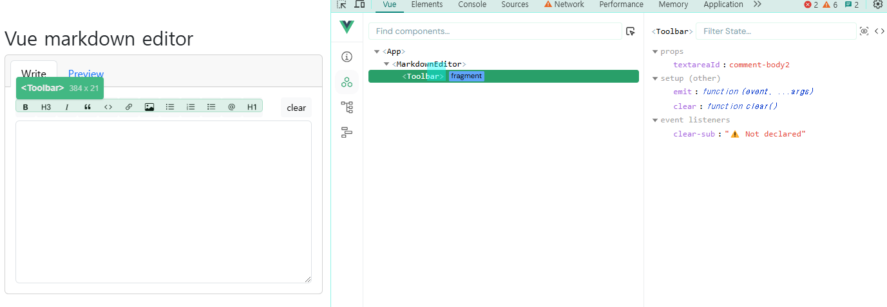
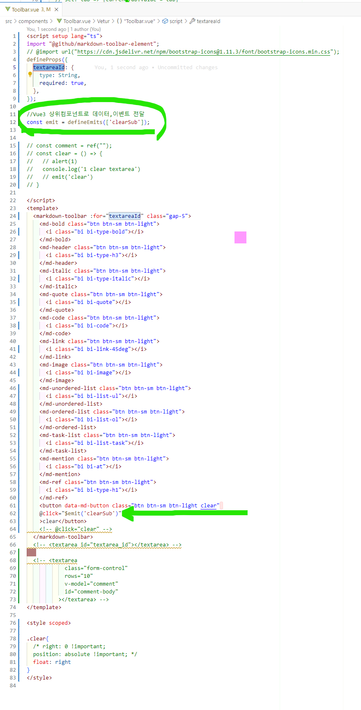
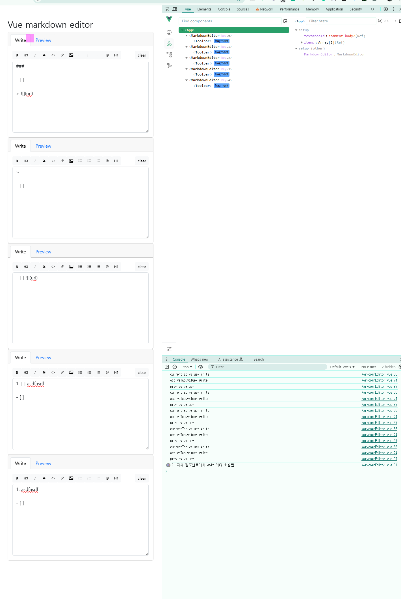
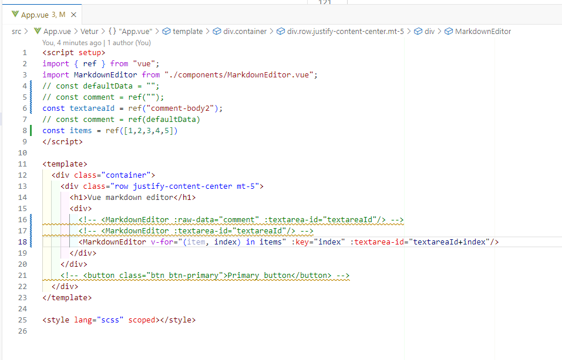

# vue-markdown-editor

This template should help get you started developing with Vue 3 in Vite.

## Recommended IDE Setup

[VSCode](https://code.visualstudio.com/) + [Volar](https://marketplace.visualstudio.com/items?itemName=Vue.volar) (and disable Vetur).

## Customize configuration

See [Vite Configuration Reference](https://vite.dev/config/).

## Project Setup

```sh
npm install
```

### Compile and Hot-Reload for Development

```sh
npm run dev
```

### Compile and Minify for Production

```sh
npm run build
```


###  vscode 설정 변경 - Max Line Width 200으로 변경 


###  따라하기 youtube 
### https://www.youtube.com/watch?v=syjJ8DXnjzY
```
Vue 3 project - Build a GitHub-like Markdown Editor with Syntax highlights supports
```

### 소스 설명
#### 1. dependencies
```
  "dependencies": {
    "@github/markdown-toolbar-element": "^2.2.3",
    "highlight.js": "^11.10.0",
    "markdown-it": "^14.1.0",
    "vue": "^3.5.12"
  },
```

#### 2. bootstrap@5.3.3
#####  index.html   
```
    <link href="https://cdn.jsdelivr.net/npm/bootstrap@5.3.3/dist/css/bootstrap.min.css" rel="stylesheet" >

```

#### 3. 설정
#####  vite.config.js
```
const customElements = [
  'markdown-toolbar',
  'md-bold',
  'md-header',
  'md-italic',
  'md-quote',
  'md-code',
  'md-link',
  'md-image',
  'md-unordered-list',
  'md-ordered-list',
  'md-task-list',
  'md-mention',
  'md-ref',
]

// https://vite.dev/config/
export default defineConfig({
  plugins: [
    vue({
      template:{
        compilerOptions:{
          isCustomElement: (tag) => customElements.includes(tag)
        }
      }

```


#### 4. 소스
##### 컴포넌트 관계 :  
   > src\App.vue 안에 src\components\MarkdownEditor.vue 안에  src\components\Toolbar.vue 

#####  App.vue  
   > 에디터 사용 - import MarkdownEditor 




#####  MarkdownEditor.vue  
   > 에디터 구현 (쓰기탭 - 툴바영역, 미리보기탭 )
   > 툴바 사용 - import Toolbar




#####  Toolbar.vue 
   > 툴바 구현




#####  컴포넌트 MarkdownEditor 의  Slot Content 영역에 textarea 사용
   - slot 영역 제거하고 부모 컴포넌트의 textarea 를 가져옮 - 성공
#####  const comment = ref(""); 로 comment를 빈 값을 가진 ref 객체로 선언하고 template 영역의 textarea 에 v-model로 ref 객체(comment)를  추가
#####  컴포넌트 MarkdownEditor 의 slot 영역 사용
https://ko.vuejs.org/guide/components/slots

 )


```
<script setup>
import { ref } from "vue";
import MarkdownEditor from "./components/MarkdownEditor.vue";

const defaultData = "";

/*
```javascript
console.log('testing')
*/

const comment = ref("");
// const comment = ref(defaultData)
</script>

<template>
  <div class="container">
    <div class="row justify-content-center mt-5">
      <h1>Vue markdown editor</h1>
      <div>
        <MarkdownEditor :raw-data="comment" target-id="comment-body">
          <textarea
            class="form-control"
            rows="10"
            v-model="comment"
            id="comment-body"
          ></textarea>
        </MarkdownEditor>
      </div>
    </div>
    <!-- <button class="btn btn-primary">Primary button</button> -->
  </div>
</template>

<style lang="scss" scoped></style>
```


#####  src\components\MarkdownEditor.vue
#####  컴포넌트 MarkdownEditor  사용 - 프로
#####  컴포넌트 MarkdownEditor 의  Slot Content 영역에 textarea 사용
#####  const comment = ref(""); 로 comment를 빈 값을 가진 ref 객체로 선언하고 template 영역의 textarea 에 v-model로 ref 객체(comment)를  추가
#####  컴포넌트 MarkdownEditor 의 slot 영역 사용
https://ko.vuejs.org/guide/components/slots

 


```
```


#####  컴포넌트 설계에 대한 생각 정리하기
   > 1. 화면 컴포넌트 만들기
   > 2. 화면의 특정 영역을 컴포넌트로 만들기
   > 3. 컴포넌트의 특정영역을 컴포넌트로 만들기
   > 4. 반복되는 최소 단위를 컴포넌트로 만들기
   > 5. 반복작업을 최소화 하고 코드 양을 줄이는데 효과적인거 같다.


##### 컴포넌트 여러개 만들어 보기




#####  가이드

해보시고 안되는 부분이나 궁금한 부분 이슈 영역에 올려주시면 답변 드릴께요.